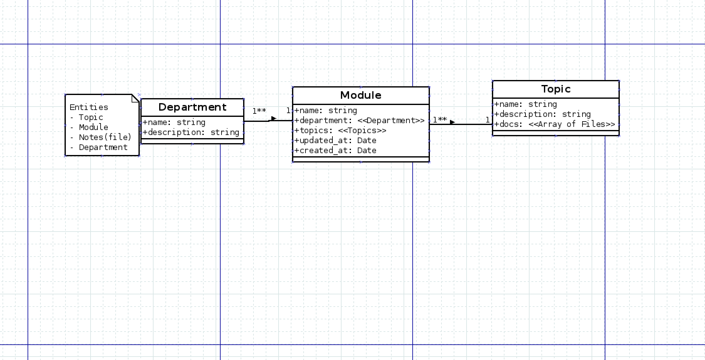

## Biomed(WIP)

Simple web application intended to support currently biomedical student at Arusha Technical College to share resources such as notes.

---

## Deployment on aws link below

- [Links to Biomed](https://master.d269xn1iq3qzq5.amplifyapp.com/)

## Develop

- Clone this repository

```sh
$ git clone https://github.com/rijkerd/biomed.git
```

- Install dependencies

```sh
$ npm install
```

- Follow instruction on how to configure aws amplify on reactjs

  - [AWS AMPLIFY](https://aws-amplify.github.io/docs/js/react)

- Run App Locally

```sh
$ npm start
```

- Run test

```sh
$ npm test
```

## Data model



## Available features:

    - User Authentication

## Tools used include

    - AWS AMPLIFY
    - DIA DIAGRAM TOOL
    - REACT JS
    - GIT
    - VSCODE EDITOR

## Contribute

The project is still in the prototypinh stage. If you would like to contribute reach me out.

## License

The MIT License (MIT)

Copyright (c) Richard Aggrey(Rijkerd)

Permission is hereby granted, free of charge, to any person obtaining a copy of this software and associated documentation files (the “Software”), to deal in the Software without restriction, including without limitation the rights to use, copy, modify, merge, publish, distribute, sublicense, and/or sell copies of the Software, and to permit persons to whom the Software is furnished to do so, subject to the following conditions:

The above copyright notice and this permission notice shall be included in all copies or substantial portions of the Software.

THE SOFTWARE IS PROVIDED “AS IS”, WITHOUT WARRANTY OF ANY KIND, EXPRESS OR IMPLIED, INCLUDING BUT NOT LIMITED TO THE WARRANTIES OF MERCHANTABILITY, FITNESS FOR A PARTICULAR PURPOSE AND NONINFRINGEMENT. IN NO EVENT SHALL THE AUTHORS OR COPYRIGHT HOLDERS BE LIABLE FOR ANY CLAIM, DAMAGES OR OTHER LIABILITY, WHETHER IN AN ACTION OF CONTRACT, TORT OR OTHERWISE, ARISING FROM, OUT OF OR IN CONNECTION WITH THE SOFTWARE OR THE USE OR OTHER DEALINGS IN THE SOFTWARE.
